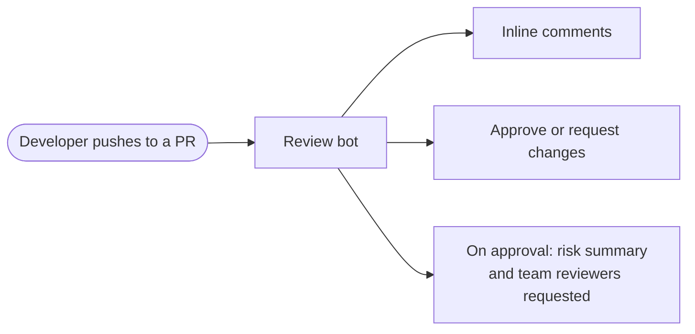
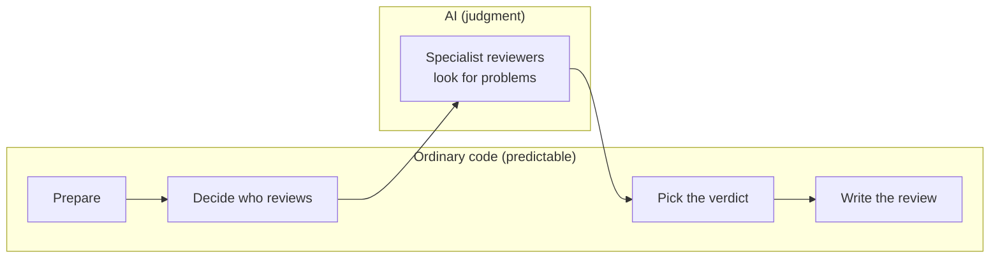
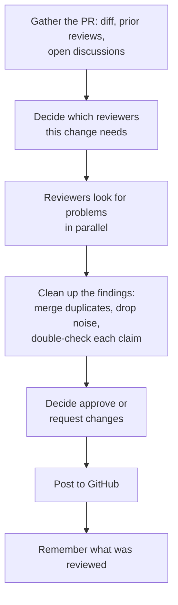
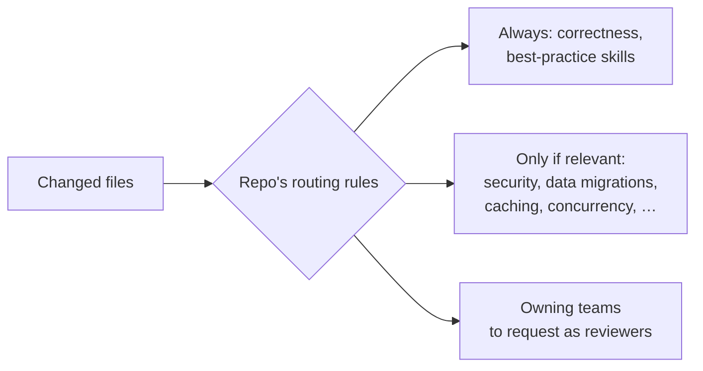
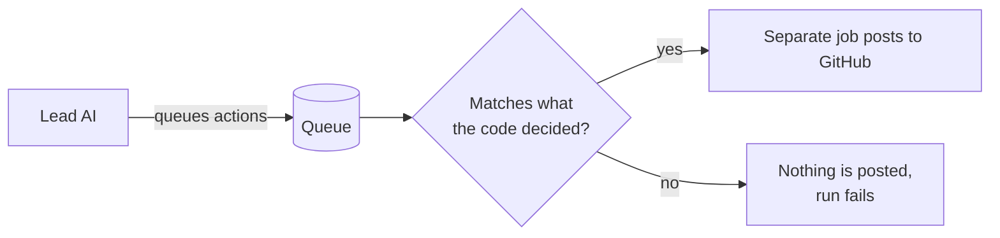
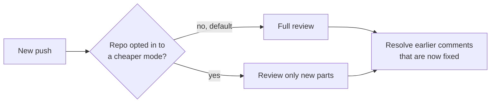
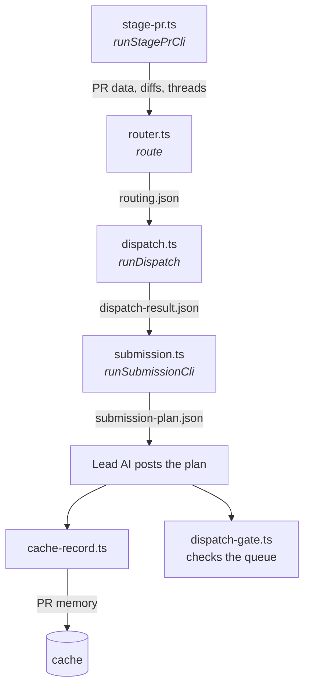
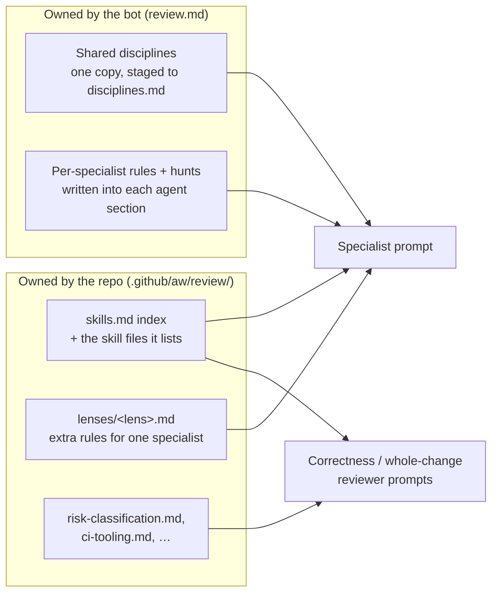

# Review Bot — Architecture

## 1. What it does

On every push to a pull request, the bot reviews the change and responds the way a
human reviewer would: inline comments, then either an approval or a request for changes.

## 2. The core idea: a script runs the review, AI finds the bugs

Most of the bot is ordinary code that follows fixed rules. AI is used only where
judgment is needed: reading code and spotting problems. A lead AI coordinates
the run, but in practice it mostly runs the scripts in order and passes their
results along.

## 3. One review, start to finish

## 4. Who reviews what

A change only gets the specialists it needs. Each repo writes its own rules
for which files need which specialists and how risky each area is.

## 5. Safety: the AI cannot post directly

The AI never has permission to write to GitHub. It can only *queue* actions.
A separate check compares that queue with what the code decided, and a separate
job holding the GitHub permissions does the posting.

## 6. Later pushes are reviewed more cheaply

The bot remembers what it has already reviewed. By default every push gets a full
review; a repo can opt in to cheaper modes that look at only the new parts. Either
way, it checks whether its earlier comments have been addressed.

## 7. Where things live

| Piece | Where |
|---|---|
| Instructions for the lead AI and the specialists | `review.md` (copied into each repo) |
| The code that runs the review | `lib/` in this repo, fetched at run time |
| Per-repo rules (routing, teams) | the repo using the bot |
| Testing and measuring the bot's quality | `eval/` (never runs during a real review) |

## 8. Known messiness

- Only one way of running the specialists exists in code ("scripted"), but comments still describe a removed "agent" mode.
- All specialist instructions live in one very large file (~3,800 lines).
- Code comments often record history and past incidents rather than explaining the design.

---

# Part 2 — Mechanisms

## 2.1 One review, mapped to files

Each step from section 3 is one script in `lib/`. The scripts pass work along as
files on disk (under `/tmp/gh-aw/review/`): each reads what the previous step
wrote. The one direct call is `stage-pr.ts` running the router's first pass.

| Step | File | Writes |
|---|---|---|
| Gather the PR | `stage-pr.ts` (also runs the router once) | `pr-context.json`, `full.diff`, `threads.json`, … |
| Decide reviewers | `router.ts` | `routing.json` |
| Find and clean up problems | `dispatch.ts` | `dispatch-result.json` |
| Pick verdict, write review | `submission.ts` | `submission-plan.json` |
| Check before posting | `dispatch-gate.ts` | pass/fail (strips the queue on fail) |
| Remember | `cache-record.ts` | `cache-memory/pr-*.json` |

## 2.2 How reviewers are prompted

Every reviewer's prompt is built from three places: text written into the bot's
`review.md`, files staged by code during the run, and files the repo using the
bot provides. Each `## agent: <name>` section of `review.md` is extracted by gh-aw
into `.claude/agents/`, which `dispatch.ts` loads and runs. The repo's files are
pulled in by `{{#runtime-import …}}` lines, which resolve when the workflow runs.

### Three kinds of rules

| | Specialist rules | Repo lens files | Repo skills |
|---|---|---|---|
| Written by | bot authors | repo team | repo team |
| Lives in | `review.md` | `lenses/<lens>.md` | skill files listed in `skills.md` |
| Reaches the prompt | always, built in | pasted in if the file exists | reviewer reads the index, then opens relevant files |
| How strictly applied | reviewer judgment | same as specialist rules | exact rule + exact line must be quoted |
| Severity from | reviewer | reviewer | the skill file (`must` / `should`) |
| Checked by | that specialist | that specialist | owning specialist if running, else `skill-auditor` |

The strictness and severity rows are instructions in the prompts, not checks in
code. `lens-payloads.ts` flags lens files that no reviewer will ever load.

### Room to consolidate

- **Lens files and skills overlap.** Both are repo-written rules for a domain;
  they differ only in how strictly they're applied. Lens files could become skills
  tagged with a specialist, giving the repo one place for rules.
- **Specialist rules could ship as built-in skills.** The bot's own domain rules
  could use the same format as the repo's, with one loading path and one strictness model.
- **The skills index is pasted into 13 prompts.** It could be staged once, as
  `disciplines.md` already is.
- **The disciplines text is still copied.** Specialists share one copy, but the
  whole-change reviewers (e.g. `skill-auditor`) each carry their own edited copy.
- **The specialist sections all have the same shape** (rules, hunts, repo add-ons,
  output), so the 11 specialist sections (~840 lines) could be generated from data
  instead of near-duplicate prose.

### Open questions

- Lens-file and ROUTING warnings land in `routing.json`, and the prompt tells the
  lead AI to show them on the review. But `submission.ts` (which writes the review
  body the lead AI must post exactly) doesn't appear to read them, so they may
  never reach the PR.

## Next sections (to be written)

Each will go one level deeper into a section above: preparing the PR, routing,
the review pipeline, verdict rules, follow-up reviews, and safety checks.
