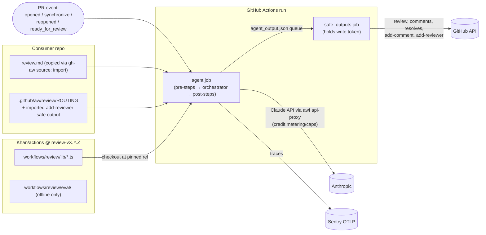
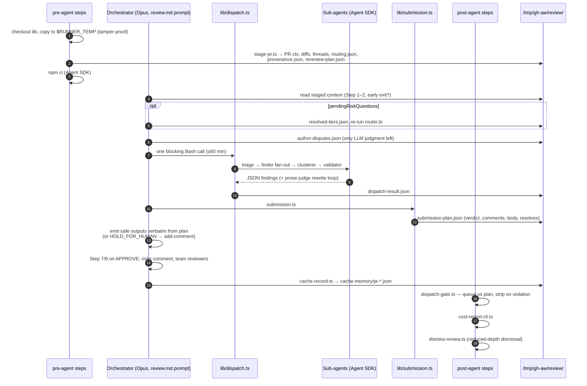
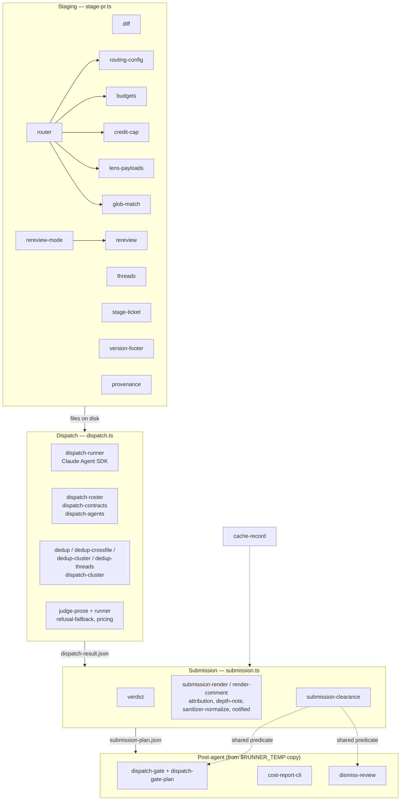

# Review Bot — Architecture Spec

A gh-aw agentic workflow (`review.md`) that reviews PRs. An LLM **orchestrator** runs a
mostly scripted pipeline: deterministic TS in `lib/` does staging, routing, dispatch,
verdict and rendering; the orchestrator mostly just shuttles the result into GitHub
safe outputs. Sub-agents are read-only and return JSON.

## 1. Deployment / runtime context

## 2. End-to-end execution path (agent job)

## 3. Module map (by pipeline stage)

## 4. Known debt / dead paths (to investigate)

- `dispatch agent` mode (orchestrator spawns sub-agents via gh-aw) vs default `scripted`; likely vestigial, still documented in prompt.
- Sub-agent prompts all live inline in `review.md` (~3.8k lines; ~20 agents).
- `eval/` is a parallel system (replay + live A/B); not in the runtime path.

## Next sections (TBD)

- Staging & routing detail
- Dispatch pipeline & sub-agent roster
- Verdict / submission rules
- Re-review depth modes
- Gate & post-agent safety
- Cache memory lifecycle
