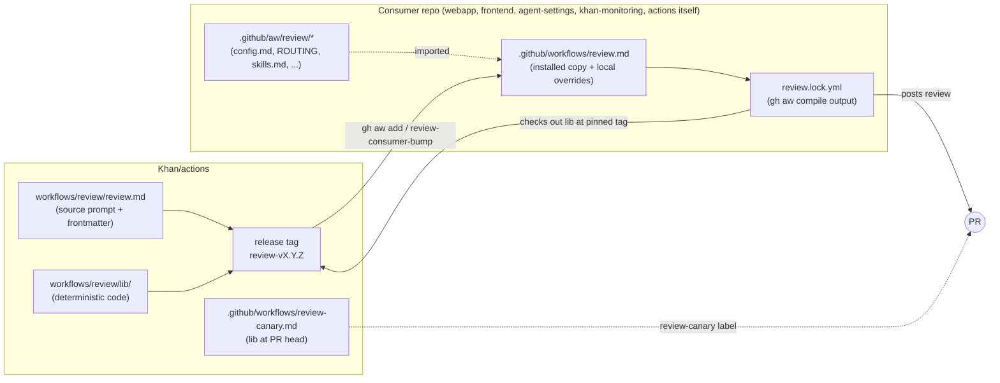
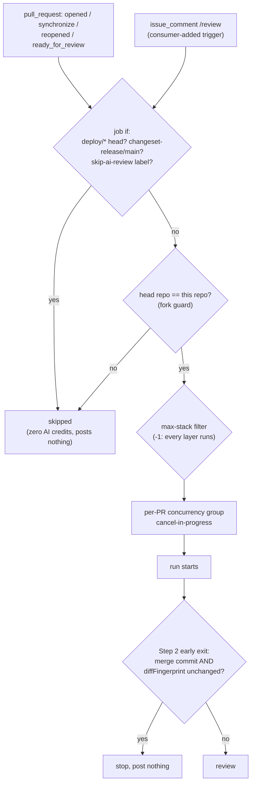
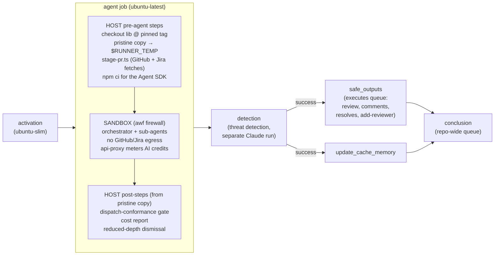
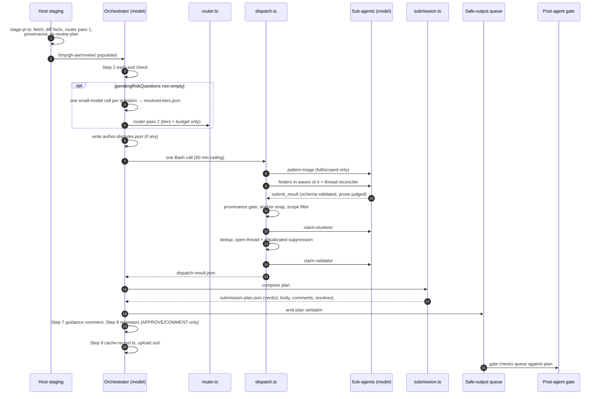
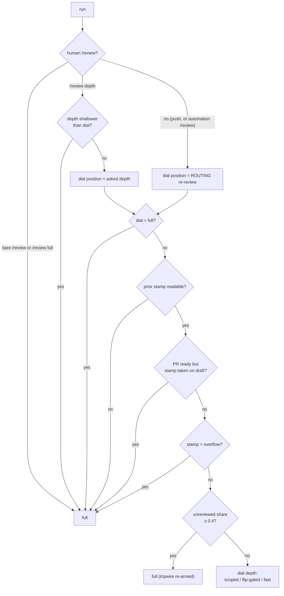
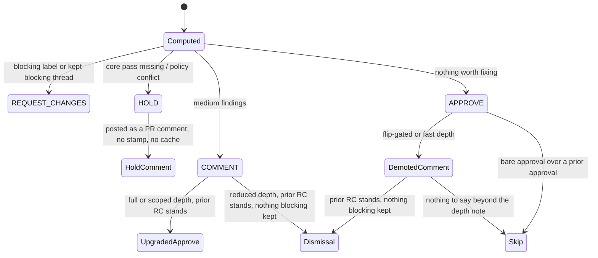

# Review bot spec

How the shared PR reviewer (`workflows/review/`) works end to end: what
triggers it, how a run is laid out across gh-aw jobs, what happens inside the
agent, how repeat reviews get cheaper, what the posted review means, what a
consuming repo configures, and what a run costs.

This is the architecture document. Consumer setup (install, the config files,
the `ROUTING` reference) lives in the [README](README.md); evaluation lives in
[`eval/README.md`](eval/README.md). Where those cover a topic in full, this
spec summarizes and links rather than repeating. For engineers adding
repo-specific knowledge to reviews, the practical guide is
[`CONTRIBUTING-KNOWLEDGE.md`](CONTRIBUTING-KNOWLEDGE.md).

The design rule that explains most of what follows: **models write words, code
owns structure.** Model agents read staged files and emit JSON. Deterministic
TypeScript CLIs decide routing, re-review depth, the verdict, which findings
post where, and the exact bytes of every comment. A post-agent gate refuses
any submission that deviates from what the code decided.

## Contents

1. [System context](#1-system-context)
2. [Triggers and gating](#2-triggers-and-gating)
3. [The run as gh-aw jobs](#3-the-run-as-gh-aw-jobs)
4. [Inside the agent run](#4-inside-the-agent-run)
5. [Re-review](#5-re-review)
6. [Routing](#6-routing)
7. [Output format](#7-output-format)
8. [Verdict semantics](#8-verdict-semantics)
9. [Consumer configuration and local overrides](#9-consumer-configuration-and-local-overrides)
10. [Cost model](#10-cost-model)
11. [Evaluation](#11-evaluation)
12. [Known gaps](#12-known-gaps)
13. [Cleanup candidates](#13-cleanup-candidates)

## 1. System context

The reviewer is a [gh-aw](https://github.github.com/gh-aw/) agentic workflow.
Its source of truth is this directory: `review.md` (gh-aw frontmatter plus the
orchestrator prompt and every sub-agent definition) and `lib/` (the
deterministic code). Consumers install a copy of `review.md` with `gh aw add`,
which compiles it into their own `review.lock.yml`. At run time, the
installed workflow checks out this repo's `lib/` at the release tag it pins,
so prompt and code always move together.

### The reference configuration

**Khan/webapp's install is the canonical configuration**, the one the shared
reviewer is converging on. Where this spec says "the default", it means the
source's code default. Other consumers' settings are deviations from
webapp's.

| Setting | Webapp (canonical) | Source default |
| --- | --- | --- |
| Trigger | `pull_request` on every push, plus a human `/review` comment (`issue_comment`) to force a full round | `pull_request` only |
| Re-review dial | `re-review fast` | `full` |
| Opt-in reviewers | all six enabled | none |
| Lenses routed | `security-auth`, `data-migrations`, `api-federation-compat` | none |
| Lens payloads | `correctness`, `security-auth` | none |
| Credit cap | `max-ai-credits: 2500` | 1000 |
| `observability:` | on (Sentry) | on |
| `max-stack` | `-1` (local override until the next release) | `-1` (unreleased) |

Webapp pins `review-v1.25.0`, two releases behind the source (1.26.0). It
still runs `claude-opus-5`, and its bodies use the pre-1.26 three-fold shape.
No consumer runs Opus 5.5 yet. §13 lists the code and prompt that exist only
for configurations webapp doesn't use.



- **Release.** A change here ships with a changeset that bumps the `review`
  package. Release cuts `review-vX.Y.Z` and a moving `review-vX` tag at the
  real tree, and `utils/sync-workflow-versions.ts` rewrites the pinned
  `ref:` inside `review.md` to match (see README
  [Versioning](README.md#versioning)).
- **Canary.** On Khan/actions only, the `review-canary` label runs a second
  reviewer with the lib checked out at the PR's head. It starts from no
  history, submits only COMMENT, and never stamps a fingerprint, so it cannot
  disturb the production reviewer's state (README
  [The canary reviewer](README.md#the-canary-reviewer-dogfooding-an-unreleased-reviewer-khanactions-only)).

## 2. Triggers and gating



**Events.** `pull_request` with types `opened`, `synchronize`, `reopened`,
`ready_for_review` (`review.md` frontmatter `on:`). The shared source
declares no comment trigger. A consumer that wants `/review` adds an
`issue_comment` trigger as a local edit. Webapp does: its `if:` splits by
event, so the push branch applies the skips below, and the comment branch
matches `/review` (tolerating trailing whitespace) and does not check
`skip-ai-review`. A comment trigger can't simply move into the shared
source: with `roles: all`, anyone who can comment on a public repo's PR
(Khan/actions) could start a paid run.

**Job-level `if:`.** A run is skipped before any AI spend when the head
branch is `deploy/*` or `changeset-release/main`, or the PR carries the
`skip-ai-review` label. The label is evaluated per event: adding it stops the
next run but does not retract an existing review.

**Forks.** gh-aw's compiled activation condition also requires
`head.repo.id == repository_id` on `pull_request` events. Khan/actions adds an
explicit `head.repo.full_name == github.repository` guard as a local override
because the repo is public.

**Roles.** `roles: all` disables gh-aw's pre-activation permission gate, so a
collaborator pushing to someone else's PR still triggers a review. That is
why the compiled lock has no `pre_activation` job.

**Drafts are reviewed.** Draft status changes three things, not whether the
run happens:

- Step 8 requests no team reviewers on a draft.
- Leaving draft (`ready_for_review`) bypasses the Step 2 early exit, so the
  PR is reviewed and routed the moment it is ready.
- A fingerprint taken on a draft never anchors a cheap re-review of the ready
  PR (§5).

**Stacked PRs.** gh-aw's `max-stack` defaults to `1`, which compiles a clause
that runs only the top PR of a GitHub-native stack. The source sets
`max-stack: -1` so every layer is reviewed. Each layer's diff is taken against
its parent branch, so layers don't re-review each other's hunks. The setting
lives in the shared `on:` block; consumers on an older release carry it as a
local override until they take the release that ships it.

**Concurrency.**

| Scope | Group | Behavior |
| --- | --- | --- |
| Workflow | `gh-aw-<workflow>-<PR number>` | `cancel-in-progress: true`: a new push to the same PR cancels the in-flight run. Separate PRs (including stack layers) run in parallel. |
| `conclusion` job | `gh-aw-conclusion-review` | Repo-wide, `cancel-in-progress: false`, `queue: max`: conclusion jobs serialize across all PRs. This adds latency on a busy repo, not cost. |

**Step 2 early exit.** This is the one gate the model still evaluates rather than code. The
orchestrator fetches the head commit's parents. A merge commit (two or more
parents) whose staged `diffFingerprint` matches the cached one changed nothing
reviewable, and the run stops. A normal commit, a changed fingerprint, or the
draft→ready transition continues. The prompt reads the head SHA from
`github.event.pull_request.head.sha`, which is empty on a comment-triggered
run, so the check is unreliable on a `/review` run (§12). A rebase
force-push has one parent, so it
always proceeds to the re-review planner (§5), which is what keeps restacks
cheap on reduced dials.

**Manual `/review`.** A `/review` comment from a human (not a Bot-type account
and not in `REVIEW_AUTOMATION_LOGINS`, default `khan-actions-bot`) plans a full
review regardless of the dial. `/review <depth>` names a one-run depth, which
may match or deepen the configured dial but never go below it
(`lib/manual-request.ts`, `decideReReviewDepth` in `lib/rereview-mode.ts`).

## 3. The run as gh-aw jobs



| Job | What it does |
| --- | --- |
| `activation` | Checks secrets, the OAuth token, and lock staleness. Snapshots `.github` from the merge ref, renders the prompt, and extracts the inline sub-agent definitions. |
| `agent` | Host staging, the sandboxed agent session, then host post-steps (below). |
| `detection` | gh-aw threat detection: a separate model pass over the queued safe outputs. |
| `safe_outputs` | Runs only if detection succeeded. It is the only job that writes to GitHub: it submits the review, posts inline comments, resolves threads, posts the guidance comment, requests reviewers, and uploads the `out/` artifact. |
| `update_cache_memory` | Persists `/tmp/gh-aw/cache-memory/pr-<n>.json`, the fallback fingerprint carrier and recall record. |
| `conclusion` | gh-aw's missing-tool / no-op / failure handling. |

**The host/sandbox boundary.** Every network fetch and every credential lives
on the host side. Before the agent starts, `lib/stage-pr.ts` writes the entire
review context to `/tmp/gh-aw/review/`. The orchestrator boots inside the awf
sandbox with no GitHub or Jira egress and reads what's on disk. Model API
calls go through the firewall's api-proxy, which meters AI credits and
enforces the per-run cap. A staging failure reds the job before any AI spend.

**The pristine lib copy.** The agent can write to the workspace, including the
lib checkout. So right after checkout, before anything else runs, the job
copies the lib to `$RUNNER_TEMP/gh-aw-review-lib-postagent`, which the
container cannot write. Every post-agent step executes from that copy.
Nothing the agent could have edited runs on the host after its turn.

**Post-agent steps.**

1. **Dispatch-conformance gate** (`lib/dispatch-gate.ts`, plan conformance in
   `lib/dispatch-gate-plan.ts`). It reads the validated safe-output queue and
   the staging and checks the queue against `submission-plan.json`: same
   event, same body, same comments, required sub-agent outputs present for the
   depth, every planned shed disclosed, no APPROVE at reduced depth, every
   thread resolution backed by the reconciler, and any staged dismissal
   licensed. On a violation it strips every posting item from the queue and
   fails the job, so a non-conforming run goes red and posts nothing. On an
   infra failure (it can't run at all) it fails open.
2. **Cost report** (`lib/cost-report-cli.ts`). It edits a collapsed
   `review cost` block onto the queued review body and writes
   `cost-report.json`. Fails open.
3. **Reduced-depth dismissal** (`lib/dismiss-review.ts`). When the plan staged
   `out/dismiss-decision.json`, it dismisses this workflow's standing
   CHANGES_REQUESTED review(s) using the bot PAT. It re-derives the target set
   from a live `GET /reviews` filtered to reviews carrying this workflow's
   stamp, so a tampered staging directory can't steer it. Known window: this
   runs before `safe_outputs` posts the COMMENT review that explains it.

## 4. Inside the agent run

### Staged files

`stage-pr.ts` writes one file per downstream consumer. The cut is
deliberate: inside the sandbox every sub-agent has the same tools and could
read any staged file, so the real access control is what never gets staged.
Human-authored thread bodies, for example, reach the sandbox only as
`{path, line}`.

| File | Contents | Read by |
| --- | --- | --- |
| `pr-context.json` | PR metadata (title, description, author, base, `headSha`, `isDraft`) | orchestrator, intent-reading agents |
| `ticket-context.json` | Linked Jira tickets (≤5), or `{available: false}` | `completeness`, `first-principles` |
| `files.json` | Changed files with `status`, `hasPatch` | router, `pattern-triage` |
| `full.diff`, `full-stripped.diff`, `full-stripped-annotated.diff` | Unified diff; generated files stripped; every line prefixed with its real line number | triage reads `full.diff`; finders read the annotated diff (anchors are read off the page, never counted) |
| `diff-facts.json` | Per-file patch fingerprint and hunk signature | Step 2, cache record |
| `new-scope.json` | Added lines new since the last review, by content | scope filter |
| `prior-reviews.json` | Every prior bot review body, with id and state | re-review planner, clearance, dismissal |
| `threads.json` | Unresolved threads this bot opened, full reply chains | `thread-reconciler`, open-thread suppression |
| `human-threads.json` | `{path, line}` of unresolved threads others opened | dispatcher skip lines |
| `adjudicated-threads.json` | Bot threads a human resolved or 👎'd | adjudicated suppression |
| `routing.json` | Router first pass (§6) | dispatcher, orchestrator |
| `provenance.json` | Changed-line map plus anchor-snap targets | provenance gate |
| `rereview-plan.json` | Depth plan (§5) | dispatcher, submission |
| `scoped.diff` | Unseen hunks only (`new-hunks` staging) | scoped swap |
| `disciplines.md` | Shared finding schema and review disciplines, cut from the prompt | every lens |

### Pipeline



**Router** (`lib/router.ts`). Deterministic. It classifies generated files
from `.gitattributes`, maps paths to specialist lenses and risk tiers from
`ROUTING`, maps files to owning teams from `.github/REVIEWERS`, and sizes the
run budget from the highest touched tier. Its one model touch is the second
pass for `direction-dependent` tiers: the router emits those files as
`pendingRiskQuestions` instead of guessing, the orchestrator asks a small model
"does this tighten or loosen what the rule guards?", and re-runs the router
once.

**Dispatcher** (`lib/dispatch.ts`). One program, invoked once:

1. **Triage.** `pattern-triage` (Sonnet) finds cross-file patterns and narrows
   the review set by dropping generated, formatting-only, and pattern-only
   files. Runs at full and scoped depth only.
2. **Roster** (`lib/dispatch-roster.ts`). The two always-on finders
   (`correctness-reviewer`, `skill-auditor`), then routed specialist lenses,
   then enabled opt-ins, capped at `runBudget.maxReviewerInvocations`.
   Capped-out reviewers become planned sheds that the body must disclose.
   Finders run in waves of 4. `thread-reconciler` runs whenever staged bot
   threads exist. Each sub-agent is capped at 15 minutes and re-dispatched
   once on a parse failure.
3. **Result channel.** Each sub-agent returns through an in-process
   `submit_result` MCP tool validated against its output contract
   (`lib/dispatch-runner.ts`). The prose judge (`lib/judge-prose.ts`) runs
   inside that path. It bounces finding prose that fails the plain-prose
   rubric back to its author for a rewrite. It is capped, and it fails open: a judge error never
   costs a finding.
4. **Provenance gate.** A finding must anchor on an added or modified line, or
   snap to one within 3 lines. Otherwise it is recorded as pre-existing and
   never posts.
5. **Scope filter.** At reduced depth, findings outside newly-changed code drop.
6. **Dedup.** Text similarity plus `claim-clusterer` (Sonnet), which names
   candidates describing the same defect. The merge rules are code, and the
   highest-severity copy survives with `also_flagged_by` attribution.
7. **Suppression.** A candidate matching an open bot thread is not re-posted
   (a suppressed blocking candidate still floors the verdict). A non-blocking
   candidate re-deriving a defect a human settled (resolved, or 👎 on the
   opener) is dropped. Blocking candidates are never adjudicated away.
8. **Claim validation.** `claim-validator` attacks each candidate's
   `failure_scenario` against the code and the relevant skill rule, then
   confirms, downgrades, or drops it.

**Finders and lenses.**

| Kind | Agents | How they run |
| --- | --- | --- |
| Always on | `correctness-reviewer`, `skill-auditor` | Every full/scoped run; `correctness-reviewer` alone at flip-gated |
| Opt-in (`enable` in ROUTING) | `holistic`, `completeness`, `test-adequacy`, `first-principles`, `conventions`, `documentation` | Shed first under the cap, in that list's reverse order: `documentation` goes first |
| Specialist lenses (`lens=` in ROUTING) | `security-auth`, `ai-safety-moderation`, `mass-comms-coppa`, `caching-resource`, `data-migrations`, `concurrency-async`, `api-federation-compat`, `cross-deploy-serialization`, `deploy-infra-config`, `money-payments`, `content-i18n` | Spawned only when a changed path matches |
| Pipeline | `pattern-triage`, `thread-reconciler`, `claim-clusterer`, `claim-validator`, prose judge | Never consume a roster slot |

**Skills.** Nothing is loaded through Claude Code's Skill mechanism. The
consumer's `skills.md` is a catalog imported into the prompt, where each
entry has a file path and an "Evaluate when" line. `skill-auditor` opens each
skill whose criteria match a touched file and audits against it. A dispatched
specialist lens owns the skills in its own domain, and `skill-auditor` skips
those. A skill finding must quote both the exact rule and the violating line.

**Findings.** Every finder emits schema-v2 JSON (`lib/finding-schema.ts`):
`lens`, `anchor` (line/file/pr), `severity` (`blocking`/`medium`/`advisory`),
`confidence`, `failure_scenario`, `evidence_trace`, `model_authored_prose`,
an optional `summary`, and the `hunts[]` record (`found`/`ran`/`not-applicable`
per incident-derived hunt). A concern outside a lens's lane goes to
`out_of_lane_observations[]` and enters validation as a non-blocking
`question`.

**Submission** (`lib/submission.ts`). It renders the re-review accountability
section, computes the verdict (§8), ranks and places findings (§7), renders
every comment and the full body, and writes `submission-plan.json`. The
orchestrator's remaining job is to type the MCP calls that plan dictates.

**Failure handling.** If `dispatch-result.json` is missing after the
dispatcher call (killed at the Bash ceiling or crashed), the orchestrator
posts one comment saying the review died mid-dispatch, linking the run, and
leaves the prior fingerprints standing so the next push reviews in full.

## 5. Re-review

Every push re-runs the reviewer, so a PR's lifetime cost is runs × cost per
run. The `re-review` dial in `ROUTING` controls how much a repeat review does.
The first full review of a ready PR always runs everything.

### The fingerprint

Every submitted review carries a fingerprint stamp in its body. A full or
scoped round stamps the current content-hashed hunk signature. A
flip-gated or fast round carries the previous anchor forward unchanged, so
reduced rounds never move the baseline that divergence is measured against.

```
<sub>pr-reviewer:rereview v=1 depth=… verdict=… anchor-draft=… hunks=<base64|overflow></sub>
```

The signature hashes each hunk's added and removed lines, ignoring line
numbers, so it survives rebases, squashes, and base merges. The stamp is the
primary carrier because it survives cache eviction and dismissed reviews. It
rides as a `<sub>` line because gh-aw's sanitizer deletes HTML comments. The
cache-memory record is the fallback (and the only carrier pre-stamp bodies
have); `rereview-plan.json`'s `stampSource` says which carrier won. Every
body since 1.21.0 carries a stamp, so the fallback rarely binds (§13).
GitHub denies cache writes on `issue_comment` runs. On webapp that affects
only human `/review` rounds: push rounds save cache normally, but a manual
full round loses its `reviewedHunks`, `risksPatternsKey` and
`requestedTeams` record (§12).

### Depths

| Depth | Dispatches | Finders see | Advances the stamp |
| --- | --- | --- | --- |
| `full` | triage + whole roster + reconciler | whole diff | yes |
| `scoped` | triage + whole roster + reconciler | `new-hunks`: only hunks no stamped review has seen | yes |
| `flip-gated` | reconciler + `correctness-reviewer` | `new-hunks` | no (anchor carried forward) |
| `fast` | reconciler only | nothing | no (anchor carried forward) |

Modifiers (`blocking-only`, `blocking-medium`) apply only when the run
executes at a reduced depth. They move non-blocking findings off the inline
surface into the body without changing the verdict. Full details:
README [Re-review modes](README.md#re-review-modes-the-runs-per-pr-cost-lever).

### Deciding the depth

`decideReReviewDepth` (`lib/rereview-mode.ts`) is pure, and every failure
resolves toward `full`:



The plan records fixed-format `reasons`
(`mode-fast`, `tripwire-divergence`, `manual-depth-below-dial`, …), and the
body's depth note says which depth ran and why.

### Restacks

A `gh stack sync` pushes every rebased layer, and each push runs (with
`max-stack: -1`). An unchanged layer's signature matches its anchor, so
divergence is about 0 and the dial applies: `fast` runs a reconcile-only round,
while `full` runs a whole review per layer per sync. The dial a consumer picks
therefore sets the cost of a restack (§10).

### Sweep

`eval/rereview-sweep.ts` prices every dial over the re-review corpus cases. It
runs from the `rereview-sweep` PR label or the `Review Re-review Mode Sweep`
workflow.

## 6. Routing

`ROUTING` (`lib/routing-config.ts`) is the consumer's machine-readable
control file. One rule per line; blanks and `#` comments are skipped.

| Line | Effect |
| --- | --- |
| `<pattern> [lens=a,b] [tier=trivial\|low\|medium\|high] [direction-dependent]` | Lenses union across matching rules; tier is last-match-wins; `direction-dependent` defers the tier to the router's second pass |
| `enable <reviewer>,…` | Turns on opt-in whole-change reviewers |
| `re-review <mode> [blocking-only\|blocking-medium]` | The re-review dial (§5); last line wins; an unknown mode degrades to `full` |
| `non-blocking-budget <n>` | Inline budget for non-blocking findings (default 3) |
| `dispatch …` | Retired; parses with a warning |

Malformed lines warn (as `Note:` lines on the review) and are skipped. Routing
degrades to fewer lenses, never to a crashed run. Without a `ROUTING` file the
router spawns no lenses, floors the budget, and notes the missing config.
The full grammar and glob semantics are in README
[The `ROUTING` file](README.md#the-routing-file).

**Budget by tier** (`lib/budgets.ts`). The highest tier any changed file
reaches sets the run budget. A PR that touches source files but matches no
lens is floored to `low`.

| Tier | Max reviewer invocations | Tool calls per finding | Total tool calls | Wall-clock target |
| --- | --- | --- | --- | --- |
| trivial | 2 | 2 | 10 | 6 min |
| low | 8 | 3 | 20 | 10 min |
| medium | 10 | 5 | 60 | 15 min |
| high | 12 | 8 | 120 | 20 min |

## 7. Output format

### Review body

```
**⛔ Changes requested** — see inline comments.           ← verdict head
<accountability section>                                   ← re-review: open prior threads, resolved count
Note: …                                                    ← sheds, depth note, config warnings
**suggestion (non-blocking):** …  <sub>found by …</sub>     ← pr-level findings
<details><summary><sub>review details</sub></summary>
**Lower-confidence observations (N):**                     ← overflow + low-confidence findings
- `file.ts:12` issue (non-blocking): subject <sub>(source)</sub>
<sub>review-v1.26.0 | schema 2 | depth full | re-review … | enable …</sub>   ← version/config footer
<sub>pr-reviewer:rereview v=1 …</sub>                      ← fingerprint stamp
</details>
<details><summary>review cost</summary> … </details>       ← appended by the post-step
```

The posted body is also a wire format that three readers parse back:

- **The next review run** reads the stamp (§5).
- **The autofix workflow** reads the observations list as its work list
  (`workflows/autofix/lib/collapsed.ts`). A collapsed finding never became a
  thread, so the body is the only place autofix can find it.
- **The conformance gate** strips and counts stamps to detect a spliced body.

Changing the render shape means every parser must still read both the new
shape and every already-posted legacy body, and autofix must ship its matcher
first. Two sanitizer rules constrain the markup:

- gh-aw deletes HTML comments, so machine-read data rides `<sub>`, `<details>`,
  and `<summary>`.
- pr-level prose is copied verbatim, so parsers assume the upper half of the
  body can quote anything, including their own anchors.

### Inline comments

The plan ranks claims (blocking first, then by confidence) and posts at most
20 inline. Blocking claims never count against the non-blocking budget.
Medium-tier claims rank ahead of minor ones, and `nitpick` never posts
inline. Everything else, plus sub-medium-confidence claims, collapses into the
observations list. Nothing validated is dropped: the verdict counts every
claim, and autofix still reaches collapsed ones. Long comments render as a
visible summary line plus one collapsed context block, with the attribution
`<sub>` line inside it.

### Labels

Conventional Comment labels are computed in code (`labelForFinding`,
`lib/render-comment.ts`):

| Finding | Label |
| --- | --- |
| `blocking` | `issue (blocking)`, or `issue (blocking, best-practice)` from a skill/best-practice lens |
| `documentation` lens | `suggestion (non-blocking, documentation)`; autofix's docs scope selects on this |
| otherwise | `suggestion (non-blocking)` / `suggestion (non-blocking, best-practice)` |
| out-of-lane handoff | `question (non-blocking)` |

When a producer's output contract carries its own label (`todo`, `question`,
`thought`, …), that label wins over the computed one
(`lib/dispatch-contracts.ts`), because the computed mapping can't express those
shapes.

### Other surfaces

- **Guidance comment** (Step 7, APPROVE at full depth only). Lists risky
  files by owning team, common patterns, `.github/NOTIFIED` matches, and files
  excluded from review. Reposted only when its code-computed signature
  changes; `hide-older-comments` collapses the previous one.
- **Reviewer requests** (Step 8, APPROVE or COMMENT, non-draft, skipped at
  flip-gated and fast depth). Requests the teams owning Medium/High-risk
  files that aren't already requested or reviewed, falling back to the top
  owning team when the PR has no human reviewer. Limited to the consumer's
  `allowed-team-reviewers`.
- **Run artifact.** `out/` (every sub-agent's JSON, the plan, the depth plan,
  claims, and the validator's verdicts) is uploaded with 30-day retention.

## 8. Verdict semantics

`computeVerdict` (`lib/verdict.ts`) is pure. Precedence:

1. **REQUEST_CHANGES**: any posted claim carries a blocking label, or a prior
   blocking thread was kept open by the reconciler (`keptBlockingCount > 0`).
2. **HOLD_FOR_HUMAN**: a core dimension (`correctness-reviewer` or
   `skill-auditor`) produced no usable output, or a lens raised a policy
   conflict. The hold outranks COMMENT because a hold writes no stamp and no
   cache record, which forces the next run to full depth.
3. **COMMENT**: any posted claim carries the medium tier.
4. **APPROVE**: otherwise.

`decideEventAndClearance` (`lib/submission-clearance.ts`) then applies the
depth rules:



- **Only full-roster depths approve.** At `flip-gated`/`fast` a would-be
  APPROVE becomes COMMENT (`approveDemoted`). Its head says why ("no new
  findings; approval requires a full review round", or points at the inline
  comments or observations it does carry).
- **A COMMENT can't clear a block.** GitHub derives a reviewer's state only
  from APPROVE or REQUEST_CHANGES. So when this workflow's prior
  REQUEST_CHANGES still stands and nothing blocks now:
  - at full or scoped depth, the run upgrades to APPROVE with a note;
  - at reduced depth, it keeps COMMENT and stages a dismissal of the standing
    review (§3 post-steps).
- **Standing blocks are identified by stamp, not login.** Every Actions
  workflow posts as `github-actions[bot]`, so only reviews carrying this
  workflow's stamp count, and only CHANGES_REQUESTED reviews after the last
  stamped APPROVED.
- **Skip submission.** Two shapes queue no review. One is a redundant bare
  approval over a prior approval. The other is a demoted COMMENT that would
  carry nothing but its head and depth note. The plan sets `skipSubmission`,
  and the gate reads the same field.
- **Canary.** Always submits COMMENT, with a body note stating the verdict it
  would have posted.

## 9. Consumer configuration and local overrides

A consumer supplies these files under `.github/aw/review/` (README
[Consumer configuration](README.md#consumer-configuration)):

| File | Required | Validated | Feeds |
| --- | --- | --- | --- |
| `config.md` | yes | compile time | the `add-reviewer` safe output: team allowlist and bot token |
| `risk-classification.md` | yes | run time | `correctness-reviewer` risk levels |
| `ci-tooling.md` | yes | run time | `correctness-reviewer`, `claim-validator` (don't flag what CI catches) |
| `skills.md` | yes | run time | `skill-auditor`, lenses, `claim-validator` |
| `ROUTING` | no | run time | the router (§6) |
| `lenses/<lens>.md` | no | run time | additive repo-specific rules for a lens; never relaxes shared rules |

Also optional and read from the tree:

- per-directory `REVIEW.md` contracts, read from the PR head as calibration,
  never as overrides;
- `.github/NOTIFIED`;
- `.github/REVIEWERS` for team ownership;
- `.gitattributes` for generated files.

`lib/check-consumer-config.ts` validates an install through the production
parsers, and `--explain <path>` shows which ROUTING rules set a path's tier.

**Secrets and variables.**

| Name | Required? | What it's for |
| --- | --- | --- |
| `ANTHROPIC_API_KEY` | yes | the model API |
| `KHAN_ACTIONS_BOT_TOKEN` | yes | reviewer requests, thread resolution, dismissal |
| `GH_AW_OTEL_SENTRY_*` | only while the `observability:` block is present | trace export |
| `REVIEW_JIRA_*` | optional | linked-ticket staging |
| `REVIEW_BOT_LOGIN` | optional | bot identity |
| `REVIEW_AUTOMATION_LOGINS` | optional | which `/review` comments count as automation |

**Updating an install.** Use the 3-way merge in
[`review-consumer-bump`](../../.claude/skills/review-consumer-bump/SKILL.md),
never `gh aw update`, which mis-pins the tag and has emptied `review.md`.
The merge preserves blocks marked `LOCAL OVERRIDE` in the installed copy.
Frontmatter that imports can't merge (an extra `if:` clause, a comment
trigger, a raised credit cap, a disabled `observability:` block) is a local
override by necessity.

**Webapp's overrides (canonical)** (`.github/workflows/review.md` in
Khan/webapp):

| Override | Why |
| --- | --- |
| `issue_comment` trigger with `reaction: eyes`, and an `if:` split per event | Human `/review` forces a full round |
| `max-ai-credits: 2500` (and the `REVIEW_MAX_AI_CREDITS` mirror) | The source's 1000 is too low for the full roster; every live consumer raises it |
| `max-stack: -1` | Carried until the release containing it is pinned |

**Khan/actions' deviations** (`.github/workflows/review.md` here):

| Override | Why |
| --- | --- |
| Fork guard in `if:` | The repo is public |
| `observability:` block disabled | No Sentry secrets |
| `max-ai-credits: 2500`, `max-stack: -1` | As webapp |
| `re-review scoped blocking-medium` (ROUTING) | Composite actions run in consumers' CI with their credentials |
| Canary kept in sync | `review-canary.md` must match the install byte for byte after its preamble (`pnpm run sync-canary`, enforced by `review-canary.test.ts`) |

Khan/agent-settings runs `scoped` with observability disabled. Khan/frontend
still runs a pre-lib install (gh-aw v0.81.6, no `ROUTING`, so the `full`
dial).

**Versioning.** Semver is the behavior contract. A behavior change bumps
major, so consumers pinned to `review-vN` opt in deliberately. A change to
what authors see says so in its changeset, including the expected change in
body size.

## 10. Cost model

**Currency.** gh-aw meters **AI credits** at the firewall's api-proxy. The
`models.providers` overlay in `review.md` prices each model at Khan's rate
(50% of Anthropic list), so 1 credit = $0.01 of real spend. An unlisted model
falls through to list price silently. After any toolchain bump, verify that
`providers` appears inside `apiProxy` in the compiled lock.

**Caps.**

| Cap | Value | Enforced by |
| --- | --- | --- |
| `max-ai-credits` | 2500 per run on webapp and every other live consumer (the source default is still 1000) | api-proxy (hard) |
| `max-daily-ai-credits` | `-1` (off), so a busy PR day never skips reviews | — |
| `max-turn-cache-misses` | 25 (sized for the cold-start burst of a parallel fan-out) | api-proxy |
| Run budget | invocations, tool calls, and wall clock by tier (§6) | dispatcher, `lib/investigation-cap.ts` |
| Soft-target clamp | budget dollar targets clamped to 0.75 × the mirrored credit cap | `lib/credit-cap.ts` |
| Job timeout | 80 min (dispatcher Bash ceiling 60 min) | GitHub Actions |

When the invocation cap binds, opt-in reviewers shed in the order
`documentation`, `conventions`, `first-principles`, `holistic`,
`completeness`, `test-adequacy`. Every shed is disclosed in the body.

**Models.**

| Role | Model |
| --- | --- |
| Orchestrator, all finders and lenses, `thread-reconciler`, `claim-validator` | `claude-opus-5-5` |
| `pattern-triage`, `claim-clusterer` | `claude-sonnet-4-6` |
| Prose judge, refusal fallback | `claude-opus-4-8` |

These are the source pins. Webapp (1.25.0) still runs `claude-opus-5` in
every Opus role. Scripted dispatch runs every sub-agent at `effort: high`. The orchestrator
runs at the model's default (`medium`) because gh-aw exposes no effort knob.

**Measured cost** (Khan/webapp, 80 successful runs, 2026-09):

| Executed depth | Mean credits | ≈ $ |
| --- | --- | --- |
| `full` | ~1330 | ~$13 |
| `fast` | ~160 | ~$1.60 |

At ~48 runs/day on webapp, the dial dominates lifetime cost. A restack of an
N-layer stack costs about (N−1) × 160 credits on `fast` and (N−1) × 1330 on
`full`. A consumer without a `re-review` line (default `full`) pays the full
multiplier on every stack sync.

**Where to read a run's cost.**

- The `review cost` block on the body gives per-agent rows, the prose judge,
  the orchestrator remainder, and a total reconciled against gh-aw's
  `ai_credits`.
- `cost-report.json` in the agent artifact has the same data.
- `lib/counters-report.ts` can aggregate run artifacts (including
  `costByRereviewDepth`), but no consumer runs the scheduled
  `review-counters.yml` today; webapp deleted it.

See README [What a review costs](README.md#what-a-review-costs-the-per-review-cost-report).

## 11. Evaluation

Reviewer changes are gated by three tiers:

1. a deterministic replay suite (`vitest`), which runs on every PR;
2. a live A/B of the changed reviewer against the release, on PRs touching
   this directory (smoke corpus);
3. powered and scheduled runs over the full corpus, triggered by labels or
   dispatch.

Opt-in reviewers and re-review dials earn their `ROUTING` lines through these
runs. See [`eval/README.md`](eval/README.md).

## 12. Known gaps

- **Restack no-op.** A rebase with unchanged content still runs a round. A
  deterministic early exit (signature equals anchor, no open bot threads, not
  the draft→ready transition) would make restacks nearly free on every dial.
- **Empty scoped diff.** At `scoped`, an unchanged layer dispatches the
  roster over an empty `scoped.diff`. Unverified whether anything
  short-circuits it.
- **Step 2 runs on the model.** The early-exit check is the one gating
  decision still made by the orchestrator rather than code. It also reads
  `github.event.pull_request.head.sha`, which is empty on a `/review` run,
  and nothing stops it from ending a human's manual ask. Moving it to code,
  reading `headSha` from `pr-context.json` and skipping on manual asks,
  fixes both.
- **Manual `/review` rounds lose their cache record.** GitHub denies cache
  writes on `issue_comment` runs, so a human full round's `reviewedHunks`,
  `risksPatternsKey` and `requestedTeams` don't persist. The next full push
  round can repost the guidance comment.
- **Safe-output emission seam.** The orchestrator still types the queue
  entries; the gate catches deviations, but removing the seam needs a writable
  path into the queue that isn't tested yet.
- **Per-role effort.** The intended effort levels (xhigh for the validator
  and security lens, medium for triage and advisory roles) aren't honored;
  everything runs `high`, and the orchestrator runs `medium`.
- **Dismissal window.** The dismissal runs before `safe_outputs` posts the
  COMMENT that explains it, so a `safe_outputs` failure can leave an
  unexplained dismissal.
- **Consumer CI for the config checker** isn't built; config errors still
  surface as a red run on someone's PR.
- **Counters** don't pool per-agent cost yet; acknowledged-thread ids are
  recorded but unused.
- **`maxUsd` budget targets** are uncalibrated estimates.
- **Frontend** runs the default `full` dial with no `ROUTING` file, so it
  pays a full review per layer per stack sync.

## 13. Cleanup candidates

Code, prompt text and docs that exist only for configurations webapp
doesn't use, or for modes that are already retired. **Dead** means nothing
live uses it. **Waits on a bump** means it can go once webapp (and
frontend, where noted) moves to the release that replaces it.

**Dead now:**

| Item | Where | Action |
| --- | --- | --- |
| The retired `dispatch` ROUTING line and the `dispatchMode` field | `lib/routing-config.ts`, `lib/router.ts` (still says "`task` when absent"), `router-dispatch-mode.test.ts` | Delete the field, the warning and the tests |
| "Task mode" / `dispatch agent` / "in this mode" wording | `review.md` frontmatter and Step 3, `lib/dispatch.ts` and `lib/dispatch-runner.ts` headers | Rewrite for the one remaining mode |
| `reviewer-mapper` described as a running sub-agent; "two roles run Fable 5" roster prose | README "How it works" and "Models and effort per role" | Rewrite; the router replaced the mapper, and the roster table is current |
| `REVIEW_AUTOMATION_LOGINS` and its `khan-actions-bot` default | `lib/manual-request.ts`, `lib/rereview-mode.ts`, `review.md`, README | Its only poster, webapp's kore shim, was removed. Keep the Bot-type check. |
| `renderRereviewStamp` (legacy block writer) | `lib/rereview-mode.ts` | Only tests use it; move it to a test helper |
| Cost report's insert-before-legacy-stamp branch | `lib/cost-report.ts` | The cost report shipped with the one-fold body, so always append |
| HTML-comment stamp prose | `lib/rereview-mode.ts`, `lib/dispatch-gate.ts`, `review.md` Step 1 | No such stamp ever posted; trim |
| Orchestrator "recall" step and cache fields `filesReviewed` / `issuesFlagged` | `review.md` Step 1, `lib/cache-record.ts` | Nothing reads them; the orchestrator no longer reviews |
| Refusal fallback for `claude-fable-5`; `providers` entry for `claude-fable-5` | `lib/refusal-fallback.ts`, `review.md` `models:`, `lib/pricing.ts` | Nothing pins Fable 5 |
| `default-ai-credits-pricing` fallback | `review.md` `models:` | Every recompiling consumer is on gh-aw v0.85.4, where the overlay is live; as written it silently bills a typo'd model at Opus rates |
| Counters docs ("`review-counters.yml` stays") | README "Feedback signal: live counters" | No consumer runs it; delete or relabel as a manual tool |
| Thumbs-sweep remnant comments | `lib/rereview.ts`, `lib/dedup-adjudicated.ts`, `lib/stage-pr.ts`, `review.md` | The sweep was removed in 1.19.0 |
| Step 7 says it skips `scoped` because "no triage" ran | `review.md` Step 7 | Triage does run at `scoped`; fix the stated reason |

**Waits on a bump:**

| Item | Where | Unblocked when |
| --- | --- | --- |
| Legacy standalone `<details>` stamp reader | `lib/rereview-mode.ts` | Webapp is on ≥1.26.0 and its in-flight PRs drain (1.25.0 still emits this form) |
| `LEGACY_COLLAPSED_SUMMARY_RE` body parsers | `lib/submission-render.ts`, `workflows/autofix/lib/collapsed.ts` | One release after webapp moves to review 1.26.0 and autofix 0.5.1 |
| Refusal fallback for `claude-opus-5` | `lib/refusal-fallback.ts` | Webapp, actions and agent-settings move to Opus 5.5 |
| `correctness-checks.md` alias and its warnings | `review.md`, `lib/lens-payloads.ts`, `check-consumer-config.ts` | Frontend's upgrade renames its file (next major) |
| `stampFromCacheMemory` fallback | `lib/rereview-mode.ts`, `lib/submission.ts`, `lib/dispatch-gate.ts` | `stampSource` in recent run artifacts confirms the body always wins; a miss degrades to `full` |
| Source `max-ai-credits: 1000` | `review.md` | Raise the source default to 2500 so webapp's override disappears |

**Kept, though webapp doesn't use them:** the `full`, `scoped` and
`flip-gated` dials (other consumers use `full` and `scoped`, and a human
`/review flip-gated` reaches the last). The same goes for `non-blocking-budget`, the
`engine.version` CLI floor (needed for Opus 5.5) and the canary machinery
(Khan/actions dogfooding). The one unused option that is a reasonable
deletion is the `blocking-only` modifier: no consumer sets it, and
`blocking-medium` replaced it.
