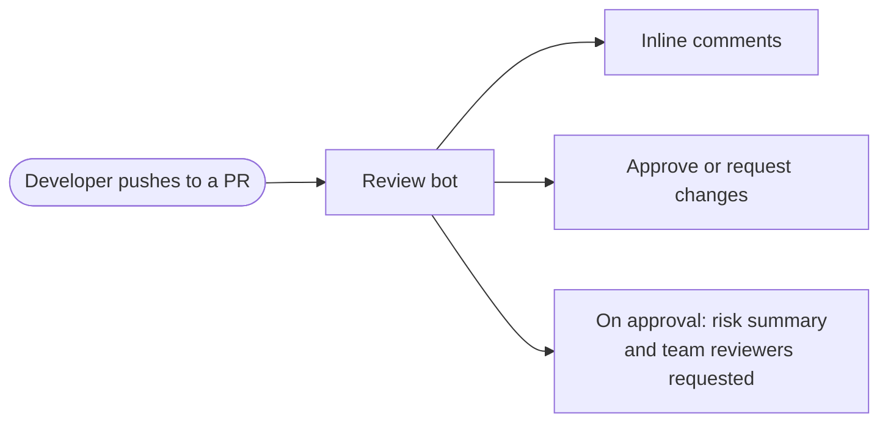
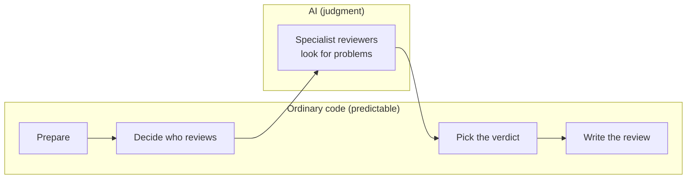
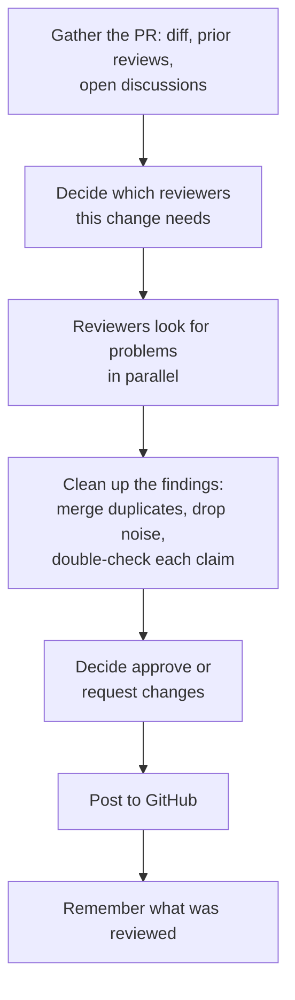
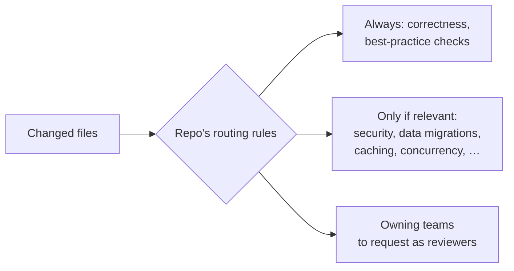
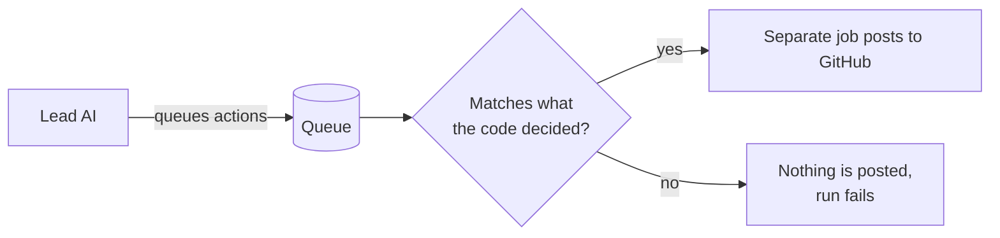
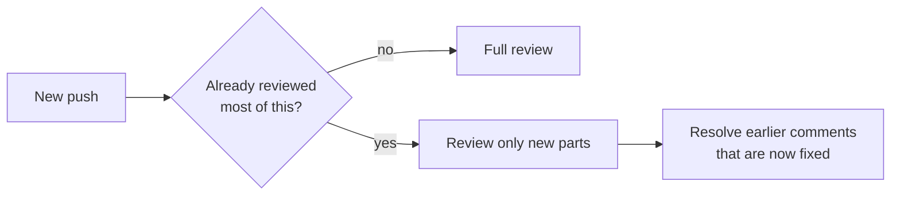

# Review Bot — Architecture Overview

## 1. What it does

On every push to a pull request, the bot reviews the change and responds the way a
human reviewer would: inline comments, then either an approval or a request for changes.

## 2. The core idea: a script runs the review, AI finds the bugs

Most of the bot is ordinary code that follows fixed rules. AI is used only where
judgment is needed: reading code and spotting problems. A lead AI coordinates
the run, but in practice it mostly runs the scripts in order and passes their
results along.

## 3. One review, start to finish

## 4. Who reviews what

A change only gets the specialists it needs. Each repo writes its own rules
for which files need which specialists and how risky each area is.

## 5. Safety: the AI cannot post directly

The AI never has permission to write to GitHub. It can only *queue* actions.
A separate check compares that queue with what the code decided, and a separate
job holding the GitHub permissions does the posting.

## 6. Later pushes are reviewed more cheaply

The bot remembers what it has already reviewed. On later pushes it can look at
only the new parts, and it checks whether its earlier comments have been addressed.

## 7. Where things live

| Piece | Where |
|---|---|
| Instructions for the lead AI and the specialists | `review.md` (copied into each repo) |
| The code that runs the review | `lib/` in this repo, fetched at run time |
| Per-repo rules (routing, teams) | the repo using the bot |
| Testing and measuring the bot's quality | `eval/` (never runs during a real review) |

## 8. Known messiness

- An older way of running the specialists is still described but looks unused.
- All specialist instructions live in one very large file (~3,800 lines).
- Code comments often record history and past incidents rather than explaining the design.

## Next sections (to be written)

Each will go one level deeper into a section above: preparing the PR, routing,
the review pipeline, verdict rules, follow-up reviews, and safety checks.
